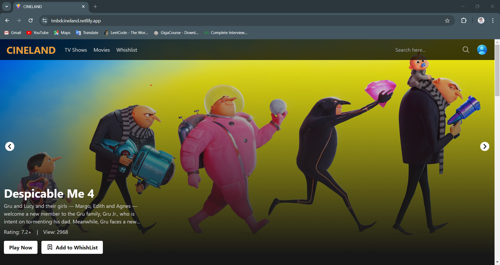
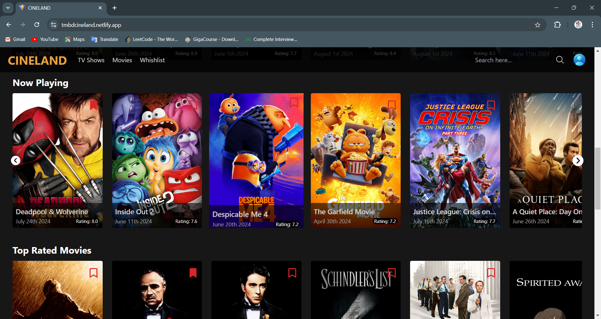
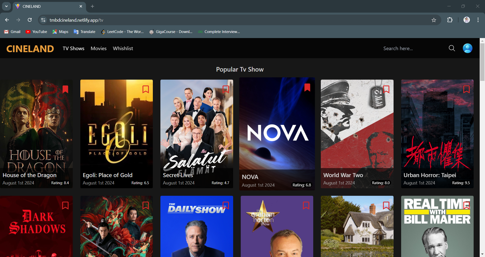
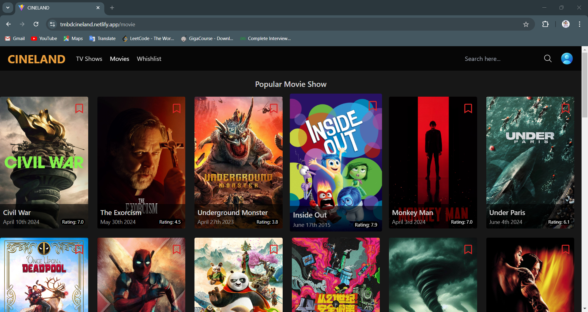
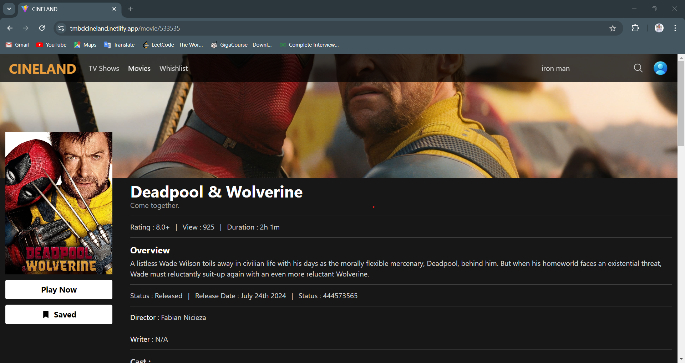
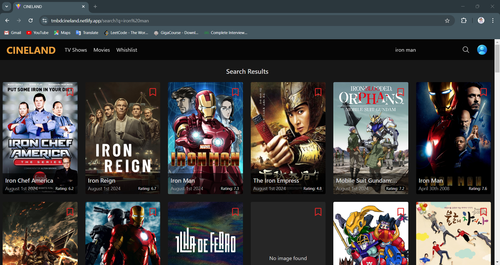
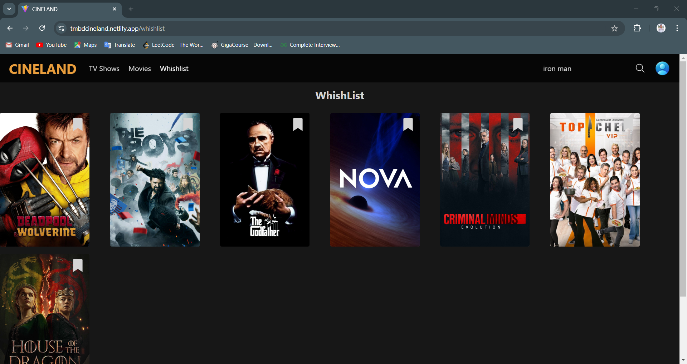

# CINELAND

CINELAND is a feature-rich platform for discovering movie, TV show, and series search platform built with React and Vite. It allows users to search for movies, TV shows, and series, add items to a wishlist, and view detailed information about movies, including cast information, trailers, ratings, release dates, and runtime etc.

## Table of Contents

- [Deployment on Netlify](#deployment-on-netlify)
- [Project Structure](#project-structure)
- [Key Features](#key-features)
- [Technologies Used](#technologies-used)
- [API](#api-used)
- [Website Images](#website-images)
- [Conclusion](#conclusion)

## Deployment on Netlify

CINELAND is already deployed on Netlify. You can access the live application at the provided Netlify URL.

[website](https://tmbdcineland.netlify.app) - https://tmbdcineland.netlify.app

## Project Structure

The project is organized into the following main directories and files:

- **App.tsx**: The main application component.
- **assets/**: Contains static assets like images and icons.
- **components/**: Reusable UI components.
- **constants/**: Project-wide constants.
- **context/**: React context definitions and providers.
- **hooks/**: Custom React hooks.
- **index.css**: Global CSS for the project.
- **main.tsx**: The entry point for the React application.
- **pages/**: Contains route-based components, representing different views such as search results, movie details, etc.
- **routes/**: Manages the routing for the application, connecting URLs to pages.
- **types/**: TypeScript type definitions for strong typing.
- **utils/**: Utility functions for common tasks.

## Key Features

- **Search Functionality**: Users can search for movies, TV shows, and series.
- **Wishlist**: Users can add movies or shows to a wishlist for easy access later.
- **Detailed Information**: Provides comprehensive details about movies, including cast, trailers, ratings, release dates, and runtime.

## Technologies Used

CINELAND is built using the following technologies:

- **React**: A JavaScript library for building user interfaces, used for creating the dynamic and responsive UI of CINELAND.
- **TypeScript**: A statically typed superset of JavaScript, providing type safety and helping catch errors during development.
- **Vite**: A modern build tool that offers a fast development environment and optimized production builds.
- **React Router**: For handling routing within the application, allowing users to navigate between different views like search results and movie details.

## API Used

CINELAND uses the [TMDb (The Movie Database) API](https://developer.themoviedb.org) to fetch data related to movies, TV shows, and series. The API provides access to detailed information such as cast, trailers, ratings, release dates, and runtime, enabling CINELAND to deliver comprehensive search results and information to users.

## Website Images

**Home**`

**Explore**

**Details page**

**Search**

**Wishlist**

## Conclusion

CINELAND is a robust and feature-rich platform for discovering movies, TV shows, and series. With a modern tech stack including React and Vite, it ensures a smooth and fast user experience. The project is successfully deployed on Netlify, providing a live and accessible version of the application.
